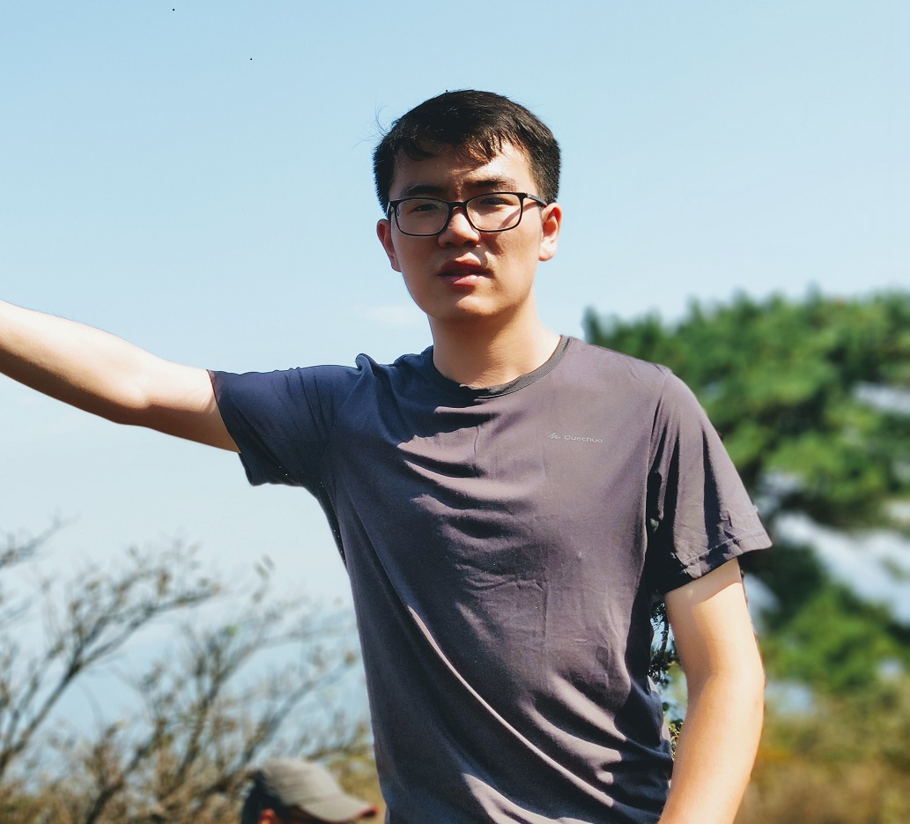

## About Me

I am a master student of Institute of Media, Information, and Networking (MIN), School of Electronic Information and Electronic Engineering, Shanghai Jiao Tong University, China. You can refer to my [Chinese blog](https://blog.nuowen.pro) for more details.

## Research Interest

- Deep reinfrocement learning
- multimedia communication
- smart transport
- and network resource optimization.

## Publications

1. Nuowen Kan, Junni Zou, Kexin Tang, Chenglin Li, Ning Liu, Hongkai Xiong, “Deep Reinforcement Learning-based Rate Adaptation for Adaptive 360-degree Video Streaming”, International Conference on Acoustics, Speech, and Signal Processing (ICASSP’2019), Brighton, UK, May, 2019.

2. Chengming Liu, Nuowen Kan, Junni Zou, Qin Yang, Hongkai Xiong, "SERVER-SIDE RATE ADAPTATION FOR MULTI-USER 360-DEGREE VIDEO STREAMING",accepted by IEEE International Conference on Image Processing(ICIP-18), 2018 [\[paper\]](https://ieeexplore.ieee.org/document/8451447)

