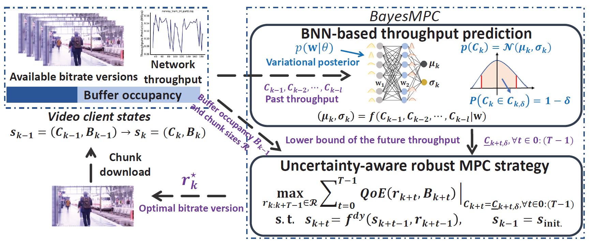

# Publications
1. **Nuowen Kan**, Chenglin Li, Caiyi Yang, Wenrui Dai, Junni Zou, Hongkai Xiong, “Uncertainty-Aware Robust Adaptive Video Streaming with Bayesian Neural Network and Model Predictive Control”, ACM Workshop on Network and Operating Systems Support for Digital Audio and Video (NOSSDAV 2021), Istanbul, Turkey, Sept. 2021. [\[code\]](https://github.com/confiwent/BayesMPC)

2. **Nuowen Kan**, Junni Zou, Chenglin Li, Wenrui Dai, Hongkai Xiong, “RAPT360: Reinforcement Learning-Based Rate Adaptation for 360-degree Video Streaming with Adaptive Prediction and Tiling”, accepted by IEEE Transactions on Circuits and Systems for Video Technology, 2021. 

3. Kexin Tang, **Nuowen Kan**, Junni Zou, Chenglin Li, Xiao Fu, Mingyi Hong, Hongkai Xiong, “Multi-user Adaptive Video Delivery over Wireless Networks: A Physical Layer Resource-Aware Deep Reinforcement Learning Approach”, accepted by IEEE Transactions on Circuits and Systems for Video Technology, 2020. [\[paper\]](https://ieeexplore.ieee.org/abstract/document/9035396) 

4. **Nuowen Kan**, Chengming Liu, Junni Zou, Chenglin Li, Hongkai Xiong, “A Server-side Optimized Hybrid Multicast-Unicast Strategy for Multi-User Adaptive 360-Degree Video Streaming”, IEEE International Conference on Image Processing (ICIP’2019), Taipei, Taiwan, China, Sep. 2019. [\[paper\]](https://ieeexplore.ieee.org/abstract/document/8803007) 

5. **Nuowen Kan**, Junni Zou, Kexin Tang, Chenglin Li, Ning Liu, Hongkai Xiong, “Deep Reinforcement Learning-based Rate Adaptation for Adaptive 360-degree Video Streaming”, International Conference on Acoustics, Speech, and Signal Processing (ICASSP’2019), Brighton, UK, May, 2019. [\[paper\]](https://ieeexplore.ieee.org/document/8683779)

6. Chengming Liu, **Nuowen Kan**, Junni Zou, Qin Yang, Hongkai Xiong, "SERVER-SIDE RATE ADAPTATION FOR MULTI-USER 360-DEGREE VIDEO STREAMING", IEEE International Conference on Image Processing(ICIP-18), Athens, Greece, 2018 [\[paper\]](https://ieeexplore.ieee.org/document/8451447) 